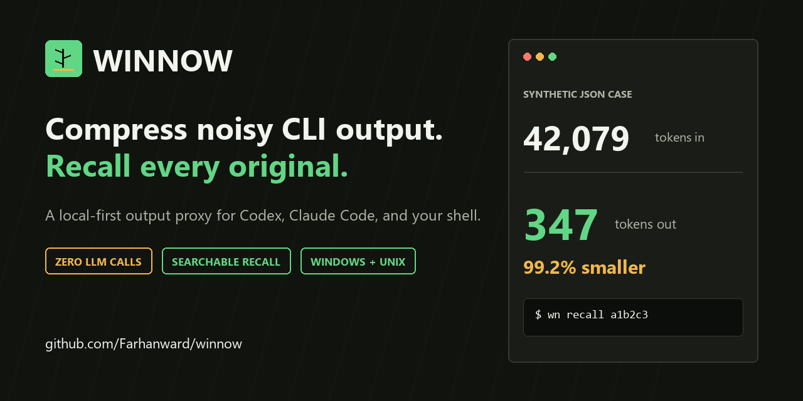
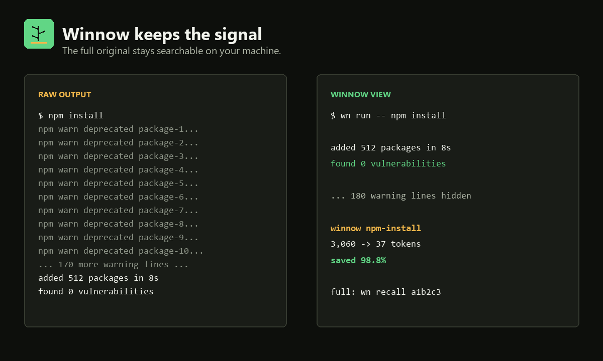

<p align="center">
  
</p>

# Winnow

[](https://github.com/Farhanward/winnow/actions/workflows/ci.yml)
[](https://github.com/Farhanward/winnow/releases)
[](https://www.python.org/)
[](LICENSE)

**Local-first CLI output compression for Codex, Claude Code, and your shell.**
Winnow removes repetitive noise before an agent reads it, makes zero LLM calls,
and keeps the complete original output in a searchable local store.

```text
$ wn run -- npm install
added 512 packages, and audited 513 packages in 8s
found 0 vulnerabilities
... <180 npm warn/notice lines hidden>
<winnow npm-install: 3,060->37 tok, saved 99% - full: wn recall a1b2c3>
```

## Install

Install the latest release directly from GitHub:

```bash
pipx install "git+https://github.com/Farhanward/winnow.git@v0.1.1"
```

Or with `uv`:

```bash
uv tool install "git+https://github.com/Farhanward/winnow.git@v0.1.1"
```

For an editable development install:

```bash
git clone https://github.com/Farhanward/winnow.git
cd winnow
python -m pip install -e ".[dev]"
```

Requires Python 3.9+. The only required runtime dependency is PyYAML. Install
the `tokens` extra for exact `tiktoken` counts:

```bash
python -m pip install "winnow-cli[tokens] @ git+https://github.com/Farhanward/winnow.git@v0.1.1"
```

## See the difference

<p align="center">
  
</p>

Run any noisy command through Winnow:

```bash
wn run -- pip install -r requirements.txt
wn run -- docker logs api
wn run -- curl -s https://api.example.com/users
```

Filter output that already exists:

```bash
kubectl logs pod-xyz | wn filter --cmd "kubectl logs"
cat huge-response.json | wn filter
```

Recall or search the full original:

```bash
wn recall a1b2c3
wn recall a1b2c3 --lines 40-80
wn recall "connection refused"
```

## Reproducible benchmark

Run `python benchmarks/benchmark.py` to execute Winnow's real pipeline against
deterministic synthetic fixtures:

| Synthetic case | Before | After | Output tokens saved |
|---|---:|---:|---:|
| npm warning wall | 3,060 | 37 | **98.8%** |
| pip satisfied chatter | 1,963 | 19 | **99.0%** |
| JSON API response | 42,079 | 347 | **99.2%** |
| repetitive server log | 4,445 | 40 | **99.1%** |

These are deliberately noisy target cases, measured with the built-in
character heuristic. They measure compression of individual command output,
not an equal reduction in an agent's total context use, API bill, or task cost.
See [benchmarks/README.md](benchmarks/README.md) for the method.

## Why Winnow

| Capability | Winnow | Basic truncation |
|---|:---:|:---:|
| Full original remains locally recallable | Yes | No |
| Search across captured output | Yes | No |
| Command-aware filters | Yes | No |
| Structure-aware JSON compression | Yes | No |
| User-defined YAML rules | Yes | No |
| Requires an LLM or network request | No | No |
| Automatic Claude Code and Codex hook | Yes | No |

Winnow is a reversible view over command output. It tees the full result to a
local SQLite store first, applies structural and declarative filters, and uses a
safety valve: small outputs or weak reductions pass through unchanged.

## Automatic agent integration

Winnow includes a conservative PreToolUse hook. It wraps eligible read-heavy
commands and leaves unknown or mutating commands alone.

```bash
wn hook show
wn hook install
```

`wn hook install` merges the hook into Claude Code's user settings, on the
`Bash`, `PowerShell`, `Read` and `Grep` matchers. For Codex, merge the output of
`wn hook show` into `~/.codex/hooks.json`, enable hooks, and review the hook in
`/hooks`. On Windows, eligible PowerShell pipelines are encoded before wrapping
so the original script remains intact.

One matcher per tool rather than one for all of them. PowerShell arrives under
its own tool name, and a `Bash`-only hook never fires for it, which on a Windows
workstation leaves most of the output uncompressed. `Read` and `Grep` do a
different job, described below.

### Editors with no hook system

Gemini, in Antigravity, runs no PreToolUse hook, so nothing rewrites its
commands for it. There it has to be explicit:

```bash
wn run --client gemini -- pkg install -y redis
```

Set `WINNOW_CLIENT=gemini` in the terminal profile and the label is picked up
without the flag. Any runtime can name itself this way; nothing here sniffs for
a variable, because neither the model nor the editor publishes one and a
guessed name would be a label that silently never matched.

The label names the runtime, not the editor around it, the same way `claude`
and `codex` do. `antigravity` is accepted as an alias so both spellings land in
one row instead of splitting a runtime's numbers across two.

### Capping Read and Grep

A PreToolUse hook rewrites a tool's **input**. `Read`, `Grep` and `Glob` build
their output inside the agent, with no command line to rewrite and no output the
hook ever sees, so no amount of matcher configuration compresses them. What the
hook can still do is cap the request, which caps the cost at the source.

- **Grep** with no `head_limit` gets one: 80 rows in `content` mode, 200 for
  `files_with_matches` and `count`. A content row carries a whole matched source
  line plus its `path:line:` prefix, and `-A`/`-B`/`-C` multiply it, so it costs
  several times what a bare path row costs. A `head_limit` the caller wrote is
  passed through untouched, including an explicit `0` for unlimited.
- **Read** of a file of 128 KiB or more with no `limit` gets one of 400 lines.
  The tool already stops at 2000 lines, so a clamp only earns its keep past
  that. The check is a `stat`, not a line count, because this runs on every
  `Read` the agent makes. `offset` is never moved, and a missing or unreadable
  path is left alone rather than failing the call.
- **Glob** is untouched. Its schema is `pattern` and `path` and nothing else: no
  limit, no head, no count. The only way to make it return less is to rewrite
  the pattern, which changes what was asked for rather than how much of it comes
  back. There is nothing here to clamp.

All four numbers live in `~/.winnow/config.json` as `grep_head_limit_content`,
`grep_head_limit_paths`, `read_large_file_bytes` and `read_clamp_lines`. Setting
any of them to `0` turns that clamp off. A value that is not a number turns its
clamp off too, rather than failing the tool call it was meant to shrink.

This is a cap, not compression. Nothing is filtered, collapsed, or stored, and
the truncated remainder is not recoverable through `wn recall`. A follow-up
`Read` with an explicit `offset`, or a narrower pattern, gets the rest.

### What gets wrapped

Eligibility is decided from the command name. A line that opens with a
directory change (`cd`, `Set-Location`, `sl`, `pushd`, `Push-Location`) joined
by `;` or `&&` is judged by the command after it instead, since `cd` says
nothing about what the line will print. The directory change is not stripped:
the whole original line is wrapped and runs as one unit, so `cd C:\X; cargo
test` still changes directory first.

On Bash, pipelines and chains go through `sh -c`, so `cargo check 2>&1 | tail
-25` reaches Winnow as one captured output. That path needs a POSIX shell on
`PATH`, which Git Bash provides on Windows. On PowerShell the line is encoded
whole and handed back, so pipelines are wrapped there too, but a chain of
separate commands past the opening `cd` is not: `cargo test; npm test` stays
unwrapped so both outputs remain visible.

Stream merges are wrapped on both shells. `2>&1`, `*>&1` and `2>>&1` hand the
bytes back to the agent, so there is everything to compress. PowerShell used to
refuse them, which cost most of the wrapping on a Windows workstation.

These stay unwrapped by design:

- Redirection to a file (`> out`, `>> log`, `*> all`), including a target that
  opens with a digit, like `> 1.log`. Those bytes go to disk, so there is
  nothing to compress.
- Any command whose deciding token is outside the known read-heavy set.
- Any line matching the mutating-command guard. Both guards read the whole
  line, not the segment eligibility came from, so `cd X; rm -rf y` stays fully
  visible.
- Any line that cannot be split confidently. Quoting is respected, so a path
  containing `;` stays one token, and an unbalanced quote leaves the line
  alone rather than being guessed at.

## Runtime efficiency

Winnow keeps aggregate efficiency counters per runtime: Codex, Claude Code,
Gemini, and local agents.

```bash
wn efficiency
wn efficiency --json
```

A real table, measured on 2026-08-19 on the machine this was developed on:

```
runtime     seen/auto   runs  compressed   tokens in→out     saved  clamped  last update
codex          2/2       939      47  108,650,822→21,351,930   80.3%     0/0    2026-08-11
claude      3076/424     411      29   236,177→138,829    41.2%    11/189  2026-08-19
gemini         0/0         0       0  no data                      0/0    -
local        202/20       20       0    30,682→30,682      0.0%     0/0    2026-07-25
```

Read the columns before reading the percentages. `seen/auto` is the honest one,
and Claude's covers two eras. Before the wrapping gaps were closed it stood at
213 selected out of 2,550 inspected, or 8.4%. Since then it is 211 out of 526,
or 40%. The cumulative 424/3,076 above averages the two eras into 13.8% and so
understates the fix threefold. `codex` shows the opposite shape, two
observations against 939 runs, because those runs arrived through an explicit
`wn run` rather than a hook.

Claude's `saved` fell from 61.6% to 41.2% across the same change, which is
coverage widening rather than compression weakening. The commands the fix
brought in are mostly short: a `git status`, a `cd X; cargo test` that prints a
few lines. They dilute the mean and add almost nothing to the total, while the
absolute saving keeps climbing. Wrapping an output with nothing to compress
costs about one token; measured against the same argv run bare, a passthrough
lands within 1% either way.

`wn gain` reports a different population and is meant to. It reads the recall
store, one record per output actually compressed, from the first release
onward. On the same machine and the same day that is 127 outputs, 106,800,987
tokens in against 16,655,223 out, 90,145,764 saved, or 84.4%. The efficiency
counters started later and count runs rather than stored outputs, so the two
never line up and neither one is the other's total.

`gemini` reads `no data` here because the label is new. An unused runtime
stays that way indefinitely and never blocks collection for the others.

`clamped` counts `Read` and `Grep` calls the hook capped against the calls it
inspected. It is reported next to the token columns and never inside them: a
clamp caps a request, so counting it as compression would publish a reduction
Winnow never performed. What it saves is measurable on its own terms. A `Read`
of a file past the threshold returns 400 lines where the tool would have
returned 2,000, which on a real file in this repository is 4,358 tokens instead
of 22,282. A content-mode `Grep` returning 80 rows instead of the tool's 250
was 1,628 tokens instead of 4,039 on a real search.

The collector is event-driven, so no background service runs. It stores only
integer counters and a last-updated timestamp in `~/.winnow/efficiency.db`:
shell calls observed, calls selected automatically, runs, compressed versus
passthrough outputs, token estimates, compression processing time, and tool
inputs seen against inputs clamped. It never receives or stores commands,
output, paths, prompts, thread IDs, or model names.
Each runtime updates independently; an unused runtime remains `no data` for any
length of time and never blocks collection for the others.

## How the pipeline works

1. **Store first:** write the complete raw output to the local recall store.
2. **Preserve structure:** compress JSON by shape instead of line slicing.
3. **Use command context:** apply built-in filters for npm, pip, pytest, git,
   and directory listings.
4. **Apply rules:** run bundled and user-authored YAML passes for repeated
   lines, error cascades, ANSI noise, and long output.
5. **Check the win:** return the original when compression saves less than the
   configured threshold.

Everything lives under `$WINNOW_HOME` (default `~/.winnow`). The store is local
and may contain sensitive command output, so protect it like shell history.

## Commands

| Command | Purpose |
|---|---|
| `wn run -- <cmd>` | Run a command and compress its output |
| `wn filter [--cmd LABEL]` | Compress stdin |
| `wn recall <handle or query>` | Fetch or search full originals |
| `wn gain [--history]` | Show token-reduction analytics |
| `wn efficiency [--json]` | Show aggregate efficiency by runtime |
| `wn skim <file>` | Reduce Python or JSON to its structure |
| `wn discover` | Find the largest stored token sources |
| `wn rules [list, path, test]` | Inspect rule packs |
| `wn hook [show, install, run]` | Configure agent integration |

## Custom rules

Add `*.yaml` files to the directory shown by `wn rules path`:

```yaml
- name: my-deploy
  match: 'deploy\.sh'
  actions:
    - strip_ansi: true
    - drop_lines: '^(DEBUG|TRACE) '
    - collapse_repeats: 3
    - keep_head_tail: [30, 40]
    - summary: 'hid {dropped} deploy log lines'
```

Supported actions include `drop_lines`, `keep_lines`, `replace`,
`collapse_repeats`, `cascade_guard`, `keep_head_tail`, `max_line_len`,
`strip_ansi`, and `summary`.

## Contributing

Issues and focused pull requests are welcome, especially sanitized examples of
noisy commands that deserve a safe filter. Read [CONTRIBUTING.md](CONTRIBUTING.md)
and report security issues privately as described in [SECURITY.md](SECURITY.md).

## License

[MIT](LICENSE)
